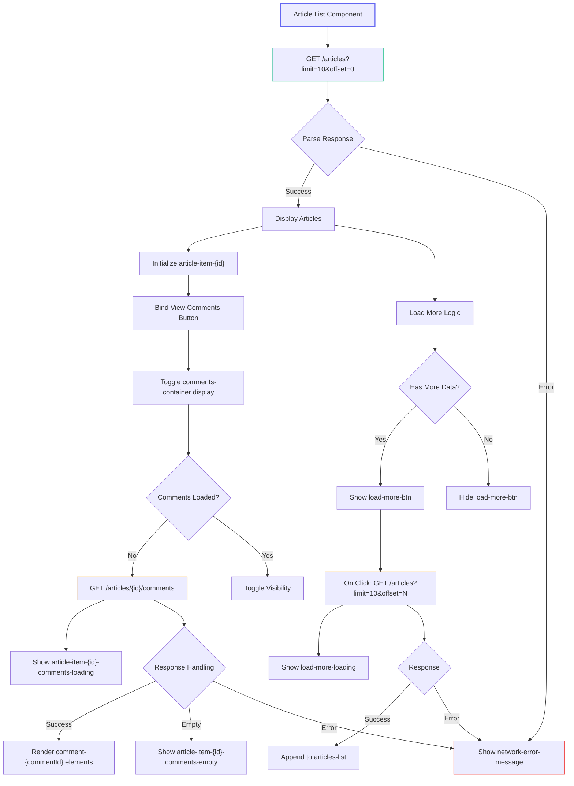
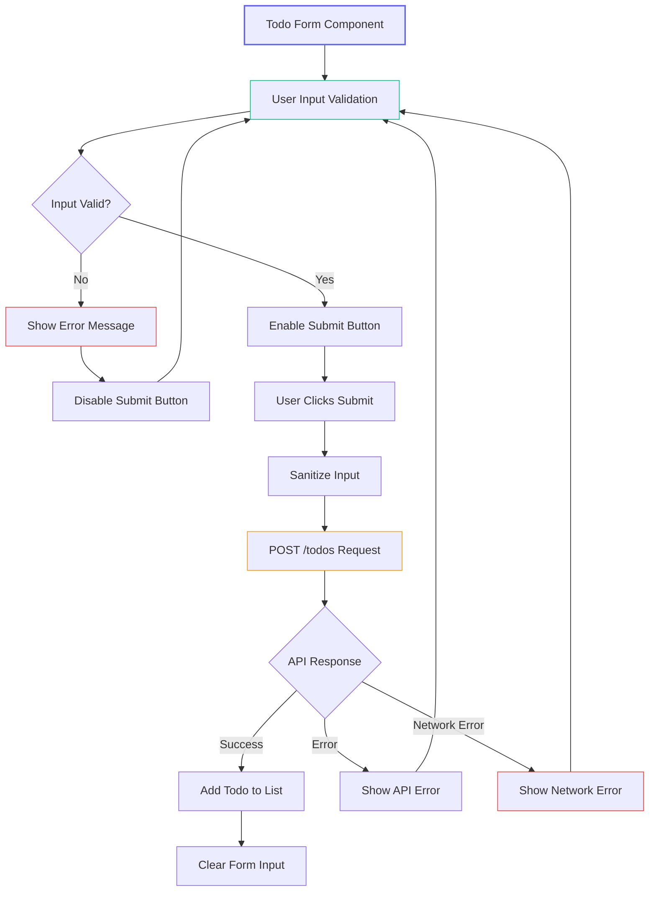
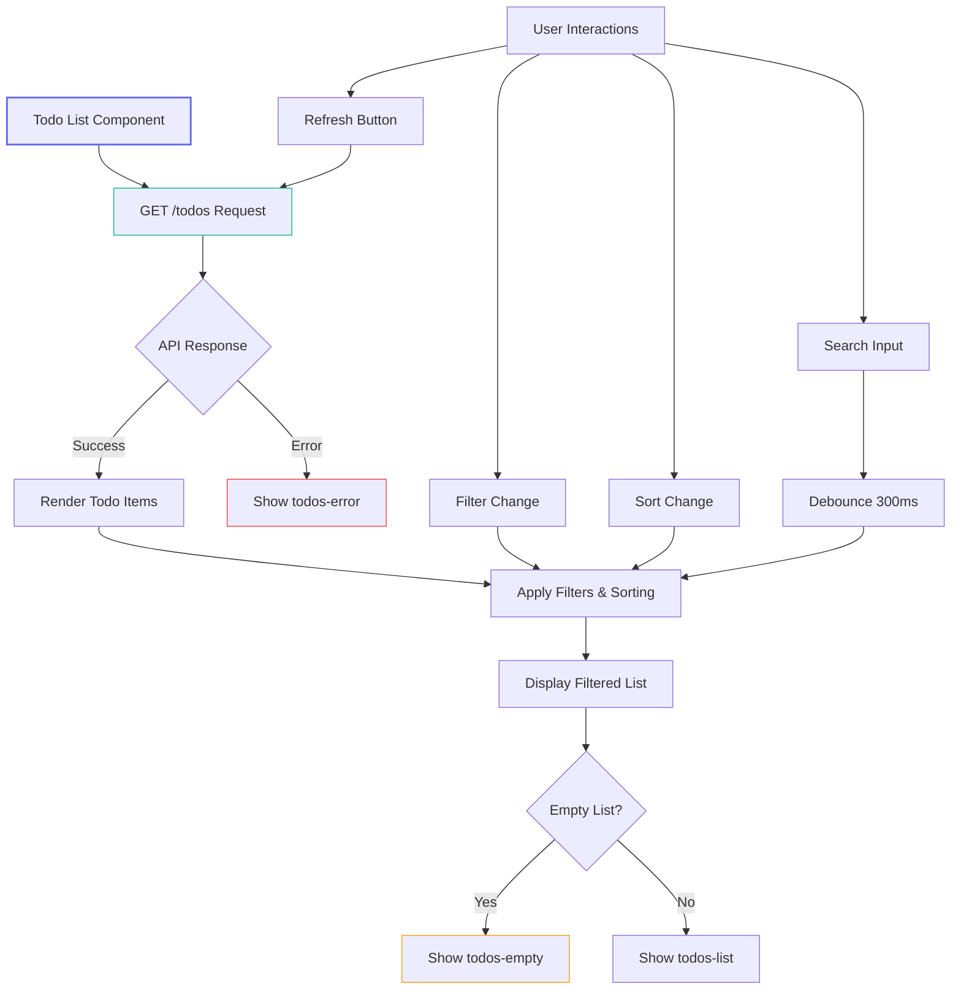
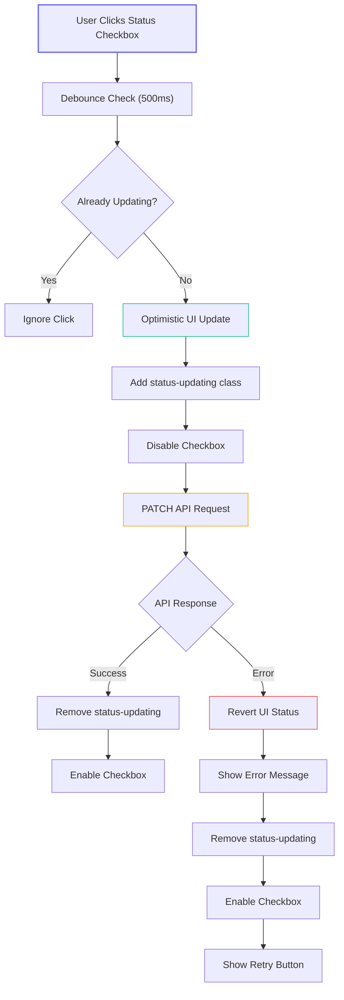
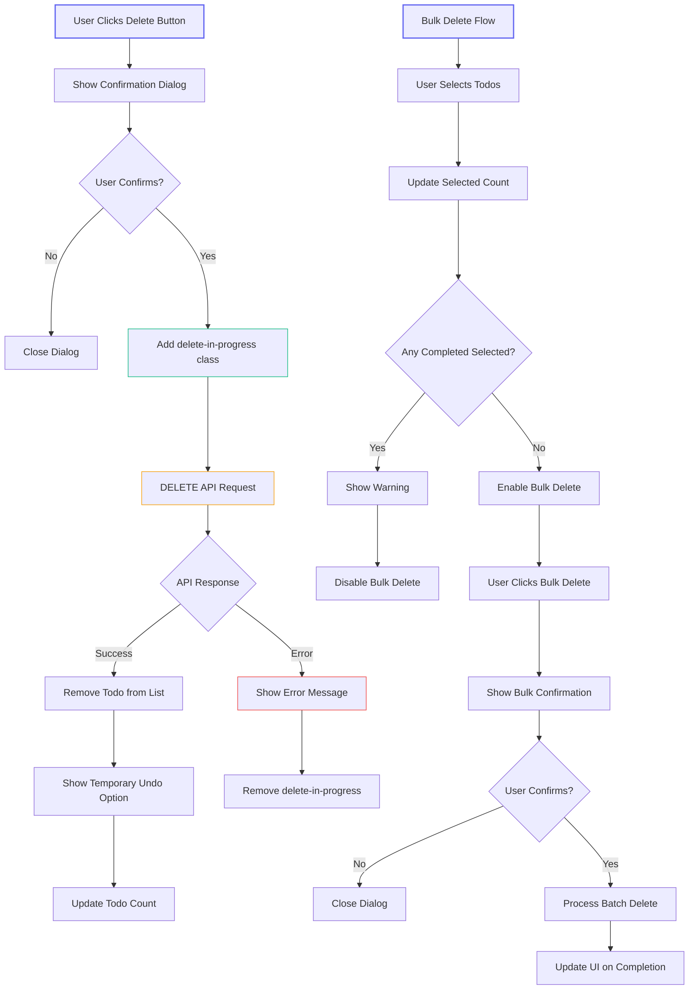

# Frontend Development Test Questions

**Required Technology:** Next.js, TypeScript

**Tips:**
- Consider using Chakra UI for faster UI development
- Implement proper error handling
- Follow Next.js best practices for routing and API handling

## Setup Instructions

1. Clone the repository:

   ```bash
   git clone <repository-url> <repository-name>
   cd <repository-name>
   ```

2. Install dependencies:

   ```bash
   npm install
   ```

3. Create `.env.local` file in project root:

   ```
   NEXT_PUBLIC_APP_URL=http://localhost:3000
   NEXT_PUBLIC_APP_BACKEND_URL=http://localhost:3000/api
   ```

   You can use any port you want for the backend, as long as it's accessible from the frontend.

4. Run the development server:

   ```bash
   npm run dev
   ```

5. Open [http://localhost:3000](http://localhost:3000)

## API Integration Notes

All API endpoints are prefixed with `NEXT_PUBLIC_APP_BACKEND_URL`. For example:

- `GET ${NEXT_PUBLIC_APP_BACKEND_URL}/articles`
- `POST ${NEXT_PUBLIC_APP_BACKEND_URL}/todos`

## Question 1: Article List with Comments

Build an article listing page with comment viewing functionality. This feature allows users to read articles and toggle the visibility of comments for each article, demonstrating handling of nested data and load more pagination.

### Core Requirements (Automated Testing)

1. Create a page at `/articles` that displays articles in list/grid format
2. Each article must contain:
   - Title (element id: `article-item-{id}-title`)
   - Creator name (element id: `article-item-{id}-creator`)
   - Comment count (element id: `article-item-{id}-comments`)
   - "View Comments" button (element id: `article-item-{id}-view-btn`)

3. Implement comments viewing:
   - Comments should be hidden by default
   - Clicking "View Comments" should toggle comments visibility
   - Comments container (element id: `article-item-{id}-comments-container`)
   - Each comment should display:
     - Content (element id: `article-item-{id}-comment-{commentId}-content`)
     - Creator name (element id: `article-item-{id}-comment-{commentId}-creator`)

4. Implement "Load More" functionality:
   - Display "Load More" button (element id: `load-more-btn`)
   - Show loading state while fetching more articles (uses `load-more-loading` ID)
   - Hide button when no more articles are available
   - Errors are handled by the global network error message (element id: `network-error-message`)

5. Handle basic states:
   - Show "No articles found" message (element id: `articles-empty-message`) when article list is empty
   - Show "No comments yet" message (element id: `article-item-{id}-comments-empty`) when comments are empty
   - Show loading states while fetching data (element ids: 
     - `articles-loading` for initial load
     - `article-item-{id}-comments-loading` for comments loading
     - `load-more-loading` for pagination loading)
   - Show network error message (element id: `network-error-message`) with retry button (element id: `retry-button`)

### Visual Flow Diagram


### HTML Structure Example

```html
<div id="article-container">
  <!-- Articles List -->
  <div id="article-list">
    <!-- Example of one article item -->
    <div id="article-item-1">
      <h2 id="article-item-1-title">Article Title</h2>
      <p id="article-item-1-creator">John Doe</p>
      <span id="article-item-1-comments">5 comments</span>
      <button id="article-item-1-view-btn">View Comments</button>

      <!-- Comments Section (hidden by default) -->
      <div id="article-item-1-comments-container" style="display: none;">
        <div id="article-item-1-comments-loading" style="display: none;">Loading comments...</div>
        <div id="article-item-1-comments-empty">No comments yet</div>
        
        <!-- Comment items -->
        <div id="article-item-1-comment-1">
          <p id="article-item-1-comment-1-content">First comment content</p>
          <p id="article-item-1-comment-1-creator">Comment Author</p>
        </div>
        <div id="article-item-1-comment-2">
          <p id="article-item-1-comment-2-content">Second comment content</p>
          <p id="article-item-1-comment-2-creator">Another Author</p>
        </div>
      </div>
    </div>
    <!-- More articles... -->
  </div>

  <!-- States -->
  <div id="articles-loading" style="display: none;">Loading articles...</div>
  <div id="articles-empty-message" style="display: none;">No articles found</div>
  <div id="network-error-message" style="display: none;">
    Network error occurred
    <button id="retry-button">Retry</button>
  </div>

  <!-- Load More -->
  <button id="load-more-btn">Load More</button>
  <div id="load-more-loading" style="display: none;">Loading more articles...</div>
</div>
```

### API Integration

`GET ${NEXT_PUBLIC_APP_BACKEND_URL}/articles`

- Query parameters:
  - `limit`: number of articles to return
  - `offset`: number of articles to skip for pagination
- Response:

```json
{
  "status": "success",
  "data": [
    {
      "id": "1",
      "title": "Article Title 2",
      "creator_name": "John Doe",
      "comments_count": 5
    },
    {
      "id": "2",
      "title": "Article Title 1",
      "creator_name": "Jane Smith",
      "comments_count": 3
    }
  ]
}
```

`GET ${NEXT_PUBLIC_APP_BACKEND_URL}/articles/{id}/comments`

- Response:

```json
{
  "status": "success",
  "data": [
    {
      "id": "1",
      "content": "First comment content",
      "creator_name": "Comment Author"
    },
    {
      "id": "2",
      "content": "Second comment content",
      "creator_name": "Another Author"
    }
  ]
}
```

## Question 2: Todo List Management

Implement a complete CRUD (Create, Read, Update, Delete) todo list application. This feature tests your ability to handle form submissions, state management, and various API interactions while maintaining proper error handling and user feedback.

### 2.A: Create Todo (Create)

Implement a form to add new todos with proper validation. This section focuses on form handling, input validation, and providing appropriate user feedback for both successful and failed submissions.

#### Core Requirements (Automated Testing)

1. Create a form with:
   - Title input (element id: `todo-form-input`)
   - Submit button (element id: `todo-form-submit`)
   - Error message container (element id: `todo-form-error`)
   - Network error message (element id: `todo-network-error`)

2. Validation requirements:
   - Submit button must be disabled when:
     - Input is empty or whitespace-only (element class: `disabled-submit`)
     - Input length < 3 characters
     - Input length > 100 characters
     - Input contains HTML/script tags
     - Title exists in current list

3. Error handling:
   - Show in `todo-form-error`:
     - "Title tidak boleh kosong" (id: `error-empty`)
     - "Title minimal 3 karakter" (id: `error-min-length`)
     - "Title maksimal 100 karakter" (id: `error-max-length`)
     - "Title mengandung karakter tidak diperbolehkan" (id: `error-invalid-chars`)
     - "Todo dengan judul sama sudah ada" (id: `error-duplicate`)

4. Input sanitization:
   - Trim whitespace
   - Convert line breaks to spaces
   - Escape HTML characters
   - Remove duplicate spaces

5. Success state:
   - Clear form after creation
   - Add new todo to list (element id: `todo-item-{id}`)

6. Error state:
   - Maintain form data on error
   - Display API errors in `todo-form-error`
   - Show network errors in `todo-network-error`

#### Visual Diagram


#### HTML Structure

```html
<form id="todo-form">
  <div class="input-group">
    <input id="todo-form-input" type="text" placeholder="Enter todo title" />
    <span id="todo-form-error" class="error"></span>
  </div>
  <button id="todo-form-submit" type="submit">Add Todo</button>
</form>
```

#### API Integration

`POST ${NEXT_PUBLIC_APP_BACKEND_URL}/todos`

- Request:

```json
{
  "title": "Buy groceries"
}
```

- Success Response (201 Created):

```json
{
  "status": "success",
  "data": {
    "id": "generated-uuid"
  }
}
```

- Error Response (422 Unprocessable Entity):

```json
{
  "status": "fail",
  "data": {
    "title": "Title tidak boleh kosong"
  }
}
```

### 2.B: List Todos (Read)

Display the list of todos with their current status. This section tests your ability to fetch and render data from an API while maintaining proper state management.

#### Core Requirements (Automated Testing)

1. Create a todo list container (element id: `todos-list`) that displays todos fetched from the API
2. Each todo item (element id: `todo-item-{id}`) must have:
   - Title (element id: `todo-item-{id}-title`)
   - Status checkbox (element id: `todo-item-{id}-status`) - checked for "done" status, unchecked for "pending"
   - Delete button (element id: `todo-item-{id}-delete`)

3. Implement filtering and sorting:
   - Status filter dropdown (element id: `filter-status`) with options:
     - "All" (default)
     - "Pending"
     - "Done"
   - Sort direction dropdown (element id: `sort-direction`) with options:
     - "Newest" (default)
     - "Oldest"
     - "Alphabetical"

4. Handle list updates:
   - Refresh button (element id: `refresh-button`) to reload the todo list
   - Show loading state (element id: `todos-loading`) while fetching data
   - Show empty state message (element id: `todos-empty`) when no todos match the current filters
   - Show error state message (element id: `todos-error`) with retry button (element id: `todos-retry`) when API request fails

5. Implement search functionality:
   - Search input (element id: `todos-search`)
   - Search results should filter the list as the user types (after 300ms debounce)
   - Show "No matching todos found" message (element id: `todos-search-empty`) when search returns no results

#### Visual Diagram


#### HTML Structure

```html
<div class="todos-container">
  <!-- Controls -->
  <div class="todos-controls">
    <input id="todos-search" type="text" placeholder="Search todos..." />
    <select id="filter-status">
      <option value="all">All</option>
      <option value="pending">Pending</option>
      <option value="done">Done</option>
    </select>
    <select id="sort-direction">
      <option value="newest">Newest</option>
      <option value="oldest">Oldest</option>
      <option value="alphabetical">Alphabetical</option>
    </select>
    <button id="refresh-button">Refresh</button>
  </div>

  <!-- Todo List -->
  <div id="todos-list">
    <!-- Example of one todo item -->
    <div id="todo-item-1">
      <span id="todo-item-1-title">Buy groceries</span>
      <input id="todo-item-1-status" type="checkbox" />
      <button id="todo-item-1-delete">Delete</button>
    </div>
    <!-- More todo items... -->
  </div>

  <!-- States -->
  <div id="todos-loading" style="display: none;">Loading todos...</div>
  <div id="todos-empty" style="display: none;">No todos found</div>
  <div id="todos-search-empty" style="display: none;">No matching todos found</div>
  <div id="todos-error" style="display: none;">
    Failed to load todos
    <button id="todos-retry">Retry</button>
  </div>
</div>
```

#### API Integration

`GET ${NEXT_PUBLIC_APP_BACKEND_URL}/todos`

- Query parameters (optional):
  - `status`: filter by status ("pending" or "done")
  - `sort`: sort direction ("newest", "oldest", "alphabetical")
  - `search`: search term

- Response:

```json
{
  "status": "success",
  "data": [
    {
      "id": "1",
      "title": "Buy groceries",
      "status": "pending",
      "created_at": "2023-06-15T10:30:00Z"
    },
    {
      "id": "2",
      "title": "Learn Next.js",
      "status": "done",
      "created_at": "2023-06-14T09:15:00Z"
    }
  ]
}
```

### 2.C: Update Todo Status (Update)

Implement a feature to update the status of a todo item. This feature demonstrates handling optimistic updates and error recovery in case of API failures.

#### Core Requirements (Automated Testing)

1. Status toggle implementation:
   - Checkbox input (element id: `todo-item-{id}-status`) that toggles between "pending" and "done"
   - Apply loading state class (`status-updating`) to the todo item while update is in progress
   - Visually indicate status:
     - "done" todos should have class `todo-done` applied to the container
     - "pending" todos should have no special class

2. Error handling:
   - Show error messages in a toast or in `todo-status-error` element:
     - "Status harus 'pending' atau 'done'" for invalid status (id: `error-invalid-status`)
     - "Todo tidak ditemukan" for deleted todos (id: `error-not-found`)
     - "Gagal mengubah status" for network errors (id: `error-network`)
     - "Too many requests" for rapid submissions (id: `error-rate-limit`)
     - "Todo status was updated by another client" for concurrent updates (id: `error-concurrent-update`)

3. Implement optimistic updates:
   - Update UI immediately on checkbox toggle
   - Send API request in background
   - If request fails, revert UI to previous state
   - Show appropriate error message

4. Implement debouncing:
   - Prevent multiple rapid toggles (minimum 500ms between toggles)
   - Disable checkbox during update (add `disabled` attribute)
   - Show visual feedback during update process

5. Handle edge cases:
   - Prevent status updates for deleted todos
   - Handle API timeouts (show timeout error after 10 seconds)
   - Implement retry mechanism for failed updates (element id: `todo-item-{id}-retry`)

#### Visual Diagram


#### HTML Structure

```html
<div id="todo-item-1" class="todo-item">
  <span id="todo-item-1-title">Buy groceries</span>
  <input
    id="todo-item-1-status"
    type="checkbox"
    aria-label="Toggle todo status"
  />
  <div id="todo-item-1-retry" style="display: none;">
    Update failed. <button>Retry</button>
  </div>
</div>
```

#### API Integration

`PATCH ${NEXT_PUBLIC_APP_BACKEND_URL}/todos/{id}/status`

- Request:

```json
{
  "status": "done"
}
```

- Success Response:

```json
{
  "status": "success",
  "data": {
    "id": "1",
    "title": "Buy groceries",
    "status": "done",
    "updated_at": "2023-06-15T14:30:00Z"
  }
}
```

- Error Response (422 Unprocessable Entity):

```json
{
  "status": "fail",
  "data": {
    "status": "Status tidak valid"
  }
}
```

### 2.D: Delete Todo (Delete)

Implement todo deletion with confirmation dialog. This section tests implementation of safe deletion patterns with proper user confirmation and error handling.

#### Core Requirements (Automated Testing)

1. Single delete functionality:
   - Delete button (element id: `todo-item-{id}-delete`)
   - Confirmation dialog (element id: `todo-item-{id}-confirm`) that appears when delete is clicked
   - Confirm button (element id: `todo-item-{id}-confirm-yes`)
   - Cancel button (element id: `todo-item-{id}-confirm-no`)
   - Apply loading state class (`delete-in-progress`) during deletion

2. Bulk delete functionality:
   - Selection checkboxes (class: `todo-select-checkbox`, id: `todo-select-{id}`)
   - "Select All" checkbox (element id: `select-all-checkbox`)
   - Bulk delete button (element id: `bulk-delete-button`) - disabled when no items selected
   - Bulk confirmation dialog (element id: `bulk-delete-confirm`)
   - Confirm bulk delete button (element id: `bulk-delete-confirm-yes`)
   - Cancel bulk delete button (element id: `bulk-delete-confirm-no`)
   - Show selected count (element id: `selected-count`)

3. Error handling:
   - Show error messages in a toast or in `todo-delete-error` element:
     - "Todo was already deleted" for race conditions (id: `error-already-deleted`)
     - "Completed todos cannot be deleted" for completed todos (id: `error-delete-completed`)
     - "Network error occurred" for connection issues (id: `error-delete-network`)
     - "Server error" for server failures (id: `error-delete-server`)

4. Implement delete restrictions:
   - Disable delete button for completed todos (add class `delete-disabled`)
   - Show tooltip with message: "Completed todos cannot be deleted" (element id: `delete-tooltip-{id}`)
   - Validate bulk delete selections (disable bulk delete if any completed todos are selected)
   - Show warning on bulk delete button when selecting completed todos (element id: `bulk-delete-warning`)

5. Handle deletion UI updates:
   - Remove todo from list on successful deletion with smooth animation
   - Show temporary "Undo" option for 5 seconds after deletion (element id: `todo-undo-{id}`)
   - Update todo count after deletion
   - Clear selection after bulk delete

#### Visual Diagram


#### HTML Structure

```html
<!-- Single Todo Item with Delete -->
<div id="todo-item-1" class="todo-item">
  <input id="todo-select-1" class="todo-select-checkbox" type="checkbox" />
  <span id="todo-item-1-title">Buy groceries</span>
  <input id="todo-item-1-status" type="checkbox" />
  <button id="todo-item-1-delete">Delete</button>
  <span id="delete-tooltip-1" class="tooltip">Completed todos cannot be deleted</span>
  
  <!-- Confirmation Dialog -->
  <dialog id="todo-item-1-confirm" class="confirm-dialog">
    <p>Are you sure you want to delete this todo?</p>
    <div class="dialog-buttons">
      <button id="todo-item-1-confirm-yes">Yes, Delete</button>
      <button id="todo-item-1-confirm-no">Cancel</button>
    </div>
  </dialog>
</div>

<!-- Bulk Delete Controls -->
<div class="bulk-actions">
  <input id="select-all-checkbox" type="checkbox" />
  <span id="selected-count">0 selected</span>
  <button id="bulk-delete-button" disabled>Delete Selected</button>
  <span id="bulk-delete-warning" style="display: none;">Cannot delete completed todos</span>
  
  <!-- Bulk Confirmation Dialog -->
  <dialog id="bulk-delete-confirm" class="confirm-dialog">
    <p>Are you sure you want to delete the selected todos?</p>
    <div class="dialog-buttons">
      <button id="bulk-delete-confirm-yes">Yes, Delete All</button>
      <button id="bulk-delete-confirm-no">Cancel</button>
    </div>
  </dialog>
</div>

<!-- Undo Delete (appears after deletion) -->
<div id="todo-undo-1" class="undo-notification" style="display: none;">
  Todo deleted. <button>Undo</button>
</div>
```

#### API Integration

`DELETE ${NEXT_PUBLIC_APP_BACKEND_URL}/todos/{id}`

- Success Response:

```json
{
  "status": "success",
  "data": null
}
```

- Error Response (404 Not Found):

```json
{
  "status": "fail",
  "data": {
    "message": "Todo not found"
  }
}
```

`DELETE ${NEXT_PUBLIC_APP_BACKEND_URL}/todos/bulk`

- Request:

```json
{
  "ids": ["1", "3", "5"]
}
```

- Success Response:

```json
{
  "status": "success",
  "data": {
    "deleted_count": 3,
    "failed_ids": []
  }
}
```

- Partial Success Response:

```json
{
  "status": "partial",
  "data": {
    "deleted_count": 2,
    "failed_ids": ["5"]
  }
}
```

## Optional Bonus Features (Manual Review)

### 1. Enhanced UI/UX

- Loading states for async operations
- Success/error toast notifications
- Smooth transitions and animations
- Responsive design
- Empty states and error handling
- Skeleton loading while fetching data

### 2. Performance Optimizations

- Implement SWR/React Query for data fetching
- Optimistic updates for todo operations
- Infinite scrolling instead of "Load More"
- Request caching
- Debounced API calls where appropriate

### 3. Dark Mode

- Theme toggle button
- System preference detection
- Persistent theme preference
- Smooth theme transition

## Testing Notes

The application will be tested using Cypress. Each core requirement has specific element IDs that must be implemented exactly as specified for automated testing to work.
